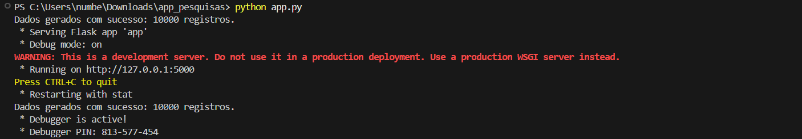
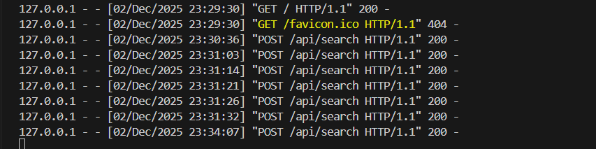
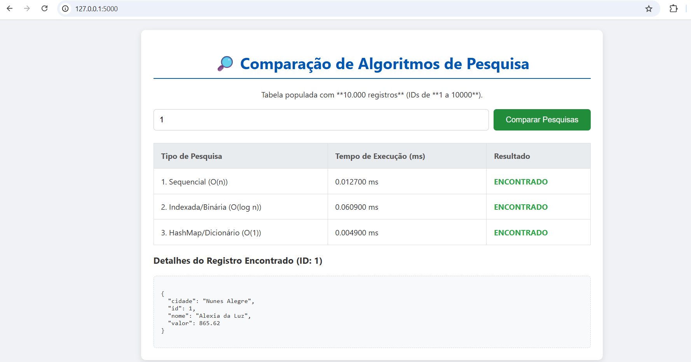
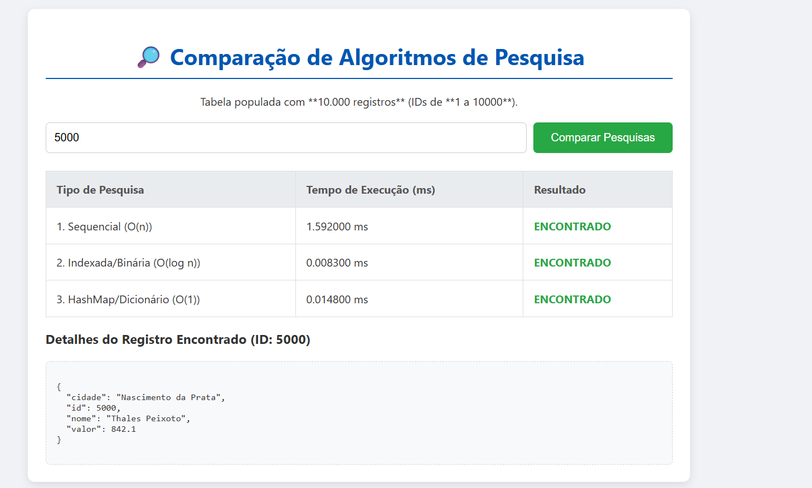
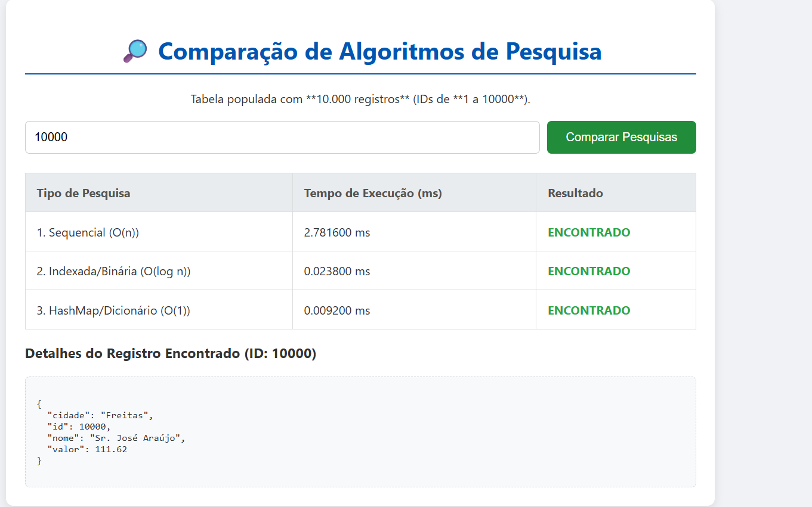

# 🧑‍💻 Trabalho: Comparação de Algoritmos de Pesquisa

## 🎓 Informações do Aluno
**Aluno(a):** Luis Felipe Da Silva Abreu
**Matrícula:** 20241243033
**Disciplina:** Algoritmos e Estruturas de Dados II

---

## ✅ Requisitos do Trabalho Cumpridos

| Requisito | Status | Observações |
| :--- | :--- | :--- |
| **Trabalho Individual** | OK |
| **Entrega por Link/Arquivo** | OK | Link do Repositório. |
| **Tabela Populada (min. 5 mil)** | OK | Populada com **10.000 registros** únicos (IDs de 1 a 10000). |
| **Mesma Fonte/Tabela** | OK | As 3 pesquisas usam a mesma estrutura de dados. |
| **Demonstração do Tempo** | OK | O tempo de execução é medido em **milissegundos** (ms) e exibido no Frontend. |
| **Aplicação Simples (Frontend/Backend)** | OK | **Backend:** Python com Flask. **Frontend:** HTML, CSS e JavaScript. |

---

## 📊 Algoritmos Implementados e Complexidade

A aplicação demonstra a diferença de desempenho ao buscar um registro pela chave `ID` em estruturas de dados otimizadas para cada algoritmo.

| Tipo de Pesquisa | Estrutura de Dados | Complexidade | Descrição |
| :--- | :--- | :--- | :--- |
| **Sequencial** | Lista Desordenada (`LISTA_SEQUENCIAL`) | **O(n)** | Percorre a lista item por item. O tempo de busca depende da posição do item. |
| **Indexada (Binária)** | Lista Ordenada (`LISTA_BINARIA`) | **O(log n)** | Requer dados previamente ordenados. Elimina metade do espaço de busca a cada passo, sendo muito eficiente para grandes volumes. |
| **por HashMap** | Dicionário Python (`HASH_MAP`) | **O(1)** | Acessa o dado diretamente pela chave, utilizando uma função hash. O tempo é constante, não dependendo do tamanho da tabela. |

---

## 🏗️ Estrutura do Projeto
app_pesquisas/ ├── app.py # Backend (Flask, Rotas e Funções de Pesquisa) ├── data_generator.py # Script para gerar e preparar os 10.000 registros ├── requirements.txt # Dependências do Python (Flask, Faker) ├── README.md # Este arquivo └── templates/ └── index.html # Frontend (Interface, HTML, CSS, JavaScript)


---

## 🚀 Guia de Execução da Aplicação

Siga estes passos para rodar o projeto na sua máquina e realizar os testes.

### 1. Pré-requisitos

* Ter o **Python 3** instalado.
* Ter o **Git** instalado (para baixar o repositório).

### 2. Configuração Inicial

#### 2.1 Clonar o Repositório

Abra o Terminal ou Git Bash e baixe o projeto:

```bash
git clone 
cd app_pesquisas
2.2 Criar e Ativar o Ambiente Virtual
É recomendado usar um ambiente virtual para isolar as dependências:


# Cria o ambiente virtual
python -m venv venv

# Ativa o ambiente virtual (Windows PowerShell)
.\venv\Scripts\activate

# Ativa o ambiente virtual (macOS/Linux/Git Bash)
# source venv/bin/activate
2.3 Instalar as Dependências
Com o ambiente virtual ativo, instale as bibliotecas Flask e Faker:


pip install -r requirements.txt
3. Execução
3.1 Iniciar o Servidor Flask
Execute o arquivo principal do backend:


python app.py
O terminal mostrará a mensagem de sucesso e o endereço de acesso, como na imagem: !



3.2 Acessar no Navegador
Abra seu navegador e digite o endereço de acesso:

[http://127.0.0.1:5000](http://127.0.0.1:5000)
4. Encerrar o Servidor
Para fechar o servidor, retorne ao terminal e pressione Ctrl + C.

📝 Resultados Observados e Análise
Instrução: Use a aplicação em http://127.0.0.1:5000 para preencher esta tabela. Teste buscando um item no início (ex: ID 1), no meio (ex: ID 5000) e no fim (ex: ID 10000) da lista de 10.000.
Conclusão sobre as Pesquisas


Os resultados comprovam a teoria da complexidade:

HashMap (O(1)) é a mais rápida, mantendo o tempo constante independentemente do tamanho da lista.

Pesquisa Binária (O(log n)) é extremamente rápida, com tempos muito próximos ao HashMap, mas exigindo a ordenação prévia dos dados.

Pesquisa Sequencial (O(n)) tem o desempenho dramaticamente afetado, sendo a mais lenta ao procurar itens no final da lista.

Resultados: 



